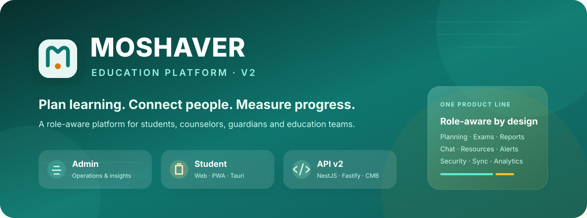
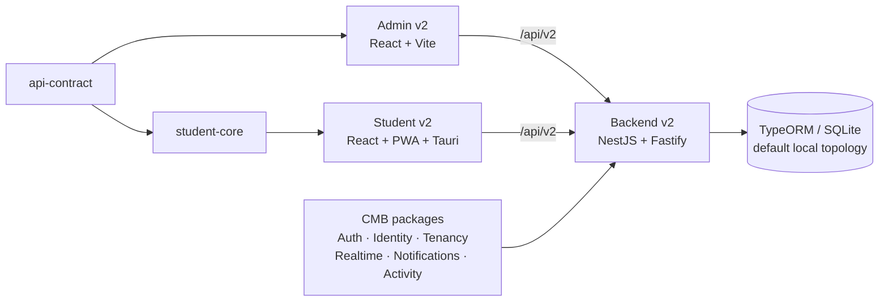

<p align="center">
  
</p>

<h1 align="center">Moshaver v2</h1>

<p align="center">
  <strong>A role-aware education platform for planning, learning, communication, assessment, reporting, and student support.</strong>
</p>

<p align="center">
  Admin web app · Student web/PWA/Tauri app · NestJS API · Shared product packages · CMB architecture
</p>

<p align="center">
  <a href="https://github.com/Mobin-Karam/moshaver/actions/workflows/backend-v2-quality.yml"></a>
  <a href="https://github.com/Mobin-Karam/moshaver/actions/workflows/admin-v2-quality.yml"></a>
  <a href="https://github.com/Mobin-Karam/moshaver/actions/workflows/student-v2-quality.yml"></a>
  <a href="https://github.com/Mobin-Karam/moshaver/actions/workflows/architecture-boundaries.yml"></a>
</p>

<p align="center">
  
  
  
  
  
  
  
</p>

---

## Table of contents

- [Overview](#overview)
- [Platform features](#platform-features)
- [Applications](#applications)
- [Architecture](#architecture)
- [Technology stack](#technology-stack)
- [Repository structure](#repository-structure)
- [Getting started](#getting-started)
- [API and OpenAPI](#api-and-openapi)
- [Development commands](#development-commands)
- [Quality and testing](#quality-and-testing)
- [Security model](#security-model)
- [Documentation](#documentation)
- [AI and repository tooling](#ai-and-repository-tooling)
- [Contributing](#contributing)
- [Legacy v14 archive](#legacy-v14-archive)
- [Repository topics](#repository-topics)
- [License](#license)

## Overview

**Moshaver** is the active v2 product line for a multi-role education and student-support system. It combines an operational admin experience, a student-facing application, a versioned backend API, reusable domain packages, and repository-level architecture tooling in one grouped product monorepo.

The current product is built around:

- **role-aware workflows** for students, counselors, guardians, operators, and other authorized users;
- **education planning and follow-up** across plans, tasks, study activity, reports, and recommendations;
- **assessment workflows** for exams, quizzes, questions, reviews, and mistake tracking;
- **communication** through chat, realtime capabilities, notifications, and live-oriented admin features;
- **student and guardian operations** with onboarding, relationships, subjects, resources, and account/access management;
- **web + native delivery** for the student experience through React, PWA adapters, Tauri, and Android build support;
- **server-enforced authorization and scoped data access** backed by the `/api/v2` service;
- **modular evolution** through CMB — Composable Modular Backend Architecture — without rewriting the product from scratch.

> `main` and `develop` are the active v2 product line. The historical v1.4 product is preserved separately on `archive/v1.4`.

## Platform features

### Admin experience

The Admin v2 application currently contains dedicated feature areas for:

| Area | Capabilities represented in the codebase |
| --- | --- |
| Access & security | Authentication, access control, role-aware/read-only UI states, security, system settings |
| Student operations | Student management, guardian workflows, onboarding, follow-up |
| Learning operations | Education, learning, subjects, learning resources |
| Planning | Planner workflows and operational follow-up |
| Assessment | Exams, quizzes, questions |
| Communication | Chat, live features, notifications |
| Insight & reporting | Dashboard, reports, operational views |
| Administration | Settings, system tools, clock/time-oriented functionality |

The admin frontend also includes React Query data workflows, form validation, Persian date/tooling support, Excel export support, accessibility tests, Playwright E2E support, and release/parity audit scripts.

### Student experience

The Student v2 application contains dedicated areas for:

- home/dashboard experience;
- authentication;
- study plans;
- exams and quizzes;
- learning content and resources;
- chat and notifications;
- audio-oriented experiences;
- reusable domain behavior through `student-core`;
- browser/PWA adapters;
- Tauri native integration;
- local SQL/native storage adapters;
- synchronization infrastructure;
- native notification and opener integrations;
- Android build support.

### Backend and platform capabilities

The NestJS v2 API contains product modules for:

- activity and analytics;
- assessments, exams, quizzes, questions, mistakes, reviews, and recommendations;
- authentication and authorization;
- chat and realtime behavior;
- dashboards and reports;
- guardians and relationships;
- health checks;
- import/export and data transfer;
- learning resources;
- notifications;
- onboarding;
- organizations and users;
- plans, tasks, and study sessions;
- students and subjects;
- sync and system operations.

Reusable CMB packages provide shared platform capabilities including health, identity, tenancy, authentication, authorization, realtime, notifications, activity, system behavior, and data transfer.

## Applications

| Project | Purpose | Primary runtime | Docker port |
| --- | --- | --- | ---: |
| [`apps/api/`](apps/api/) | Versioned backend API and composition root | NestJS + Fastify + TypeORM | `4000` |
| [`apps/admin/`](apps/admin/) | Role-aware administration platform | React + Vite | `8081` |
| [`apps/student/`](apps/student/) | Student web/PWA/native application | React + Vite + Tauri | `8080` |
| [`student-core/`](student-core/) | Runtime-neutral student domain and provider contracts | TypeScript package | — |
| [`packages/api-contract/`](packages/api-contract/) | Shared API contract boundary | TypeScript contract package | — |
| [`packages/cmb/`](packages/cmb/) | Reusable CMB platform capabilities | TypeScript packages | — |

## Architecture

Moshaver uses a **grouped product monorepo** with a **modular-monolith backend**. The API remains the composition root while reusable platform capabilities are extracted into CMB packages incrementally.



Architecture rules are enforced by repository tooling and GitHub Actions rather than being documentation-only conventions.

Start with:

- [Architecture entry point](ARCHITECTURE.md)
- [Repository architecture](docs/architecture/repository-architecture.md)
- [System map](docs/architecture/system-map.md)
- [Dependency boundaries](docs/architecture/dependency-boundaries.md)
- [Backend v2 design](docs/architecture/backend-v2-design.md)
- [Student core boundary](docs/architecture/student-core-boundary.md)
- [Student v2 / Tauri runtime](docs/architecture/student-v2-tauri-runtime.md)

## Technology stack

| Layer | Main technologies |
| --- | --- |
| Admin frontend | React 18, Vite 6, React Router 7, TanStack Query 5, React Hook Form, Zod, Tailwind CSS, Framer Motion, Lucide, Persian Tools, React Multi Date Picker |
| Student frontend | React 18, Vite 5, React Router 6, Zustand, Tailwind CSS, Tauri 2, Tauri SQL/Notification/Opener plugins |
| Backend | NestJS 11, Fastify, TypeORM, Swagger/OpenAPI, class-validator, Zod, RxJS |
| Default persistence | SQLite via `better-sqlite3` + TypeORM |
| Security middleware | Helmet, CORS, cookies, DTO validation, capability authorization, CSRF-aware authenticated mutations |
| Testing | Jest, Vitest, Testing Library, axe-core, Playwright |
| Delivery | Docker / Docker Compose, Tauri native builds, Android build path |
| Repository tooling | Custom workspace runner, architecture checks, API-contract checks, generators, Graphify fingerprinting |

## Repository structure

```text
moshaver/
├── apps/
│   ├── admin/                  # Admin v2 React/Vite application
│   ├── api/                    # NestJS/Fastify API v2
│   └── student/                # Student React/PWA/Tauri application
├── packages/
│   ├── api-contract/           # Shared API contracts
│   └── cmb/                    # Composable Modular Backend capabilities
├── student-core/               # Runtime-neutral student product package
├── docs/                       # Architecture, components, operations, product, releases, history
├── tooling/                    # Workspace, architecture, generators, contracts, Graphify tooling
├── graphify-out/               # Repository graph/fingerprint output
├── examples/                   # Repository examples
├── scripts/                    # Supporting scripts
├── .github/                    # CI, instructions, prompts, agents and repository automation
├── docker-compose.yml          # Canonical local v2 topology
├── ARCHITECTURE.md             # Architecture entry point
└── README.md                   # You are here
```

The repository intentionally uses **leaf lockfiles** rather than a single root dependency lockfile. The workspace graph lives at [`tooling/workspace/projects.json`](tooling/workspace/projects.json).

## Getting started

### Option 1 — run the complete stack with Docker

**Requirements:** Git and Docker with Docker Compose.

```bash
git clone https://github.com/Mobin-Karam/moshaver.git
cd moshaver
git checkout develop
docker compose up --build
```

Open:

| Service | URL |
| --- | --- |
| Student v2 | `http://localhost:8080` |
| Admin v2 | `http://localhost:8081` |
| Backend health | `http://localhost:4000/health` |
| Backend readiness | `http://localhost:4000/ready` |
| Swagger UI | `http://localhost:4000/api/v2/docs` |
| OpenAPI JSON | `http://localhost:4000/api/v2/openapi.json` |

Stop the stack with:

```bash
docker compose down
```

Do **not** add `--volumes` unless deleting local persisted data is intentional.

### Option 2 — package-level development

**Requirements:** Node.js `>=22.13.0 <23` for repository-level tooling, plus the native toolchains required by Tauri/Android if you build native targets.

Bootstrap the repository:

```bash
npm run bootstrap
npm run workspace:check
```

For backend development:

```bash
cp apps/api/.env.example apps/api/.env
npm --prefix apps/api run migration:run
npm --prefix apps/api run seed
npm --prefix apps/api run dev
```

Run a frontend in a separate terminal:

```bash
npm --prefix apps/admin run dev
# or
npm --prefix apps/student run dev
```

For Admin deployments, the example frontend API setting is:

```env
VITE_API_URL=/api/v2
```

Never commit generated `.env` files, credentials, tokens, database files, or production secrets.

## API and OpenAPI

The API uses the global prefix:

```text
/api/v2
```

Health endpoints remain outside the prefix:

```text
/health
/ready
```

Interactive and machine-readable API documentation are exposed at:

```text
/api/v2/docs
/api/v2/openapi.json
```

The API bootstrap configures request validation, CORS, Helmet, cookies, Swagger, structured API schemas, cookie authentication, and the `X-CSRF-Token` security definition used for authenticated state-changing requests.

See [Backend v2 HTTP API](docs/components/backend-v2-http-api.md) for the repository's API documentation.

## Development commands

### Root workspace

```bash
npm run workspace:list       # list registered projects
npm run workspace:check      # validate workspace metadata
npm run workspace:plan       # show workspace execution plan
npm run bootstrap            # bootstrap registered projects
npm run build                # build workspace projects
npm run test                 # run project test tasks
npm run typecheck            # run project type checks
npm run lint                 # run project lint tasks
npm run verify               # full workspace verification
npm run verify:affected      # verify affected projects
npm run architecture:check   # architecture and CMB boundary checks
npm run contracts:check      # API contract checks
npm run graphify:check       # validate Graphify fingerprint
npm run generate:cmb         # scaffold a CMB package
npm run generate:product     # scaffold a product package
```

### Backend

```bash
npm --prefix apps/api run dev
npm --prefix apps/api run build
npm --prefix apps/api run lint
npm --prefix apps/api test
npm --prefix apps/api run migration:run
npm --prefix apps/api run migration:revert
npm --prefix apps/api run seed
npm --prefix apps/api run test:e2e:security
npm --prefix apps/api run test:e2e:student
npm --prefix apps/api run test:e2e:onboarding
```

### Admin

```bash
npm --prefix apps/admin run dev
npm --prefix apps/admin run build
npm --prefix apps/admin run typecheck
npm --prefix apps/admin run lint
npm --prefix apps/admin test
npm --prefix apps/admin run test:coverage
npm --prefix apps/admin run test:a11y
npm --prefix apps/admin run test:e2e
npm --prefix apps/admin run audit:parity
npm --prefix apps/admin run audit:release
```

### Student

```bash
npm --prefix apps/student run dev
npm --prefix apps/student run build
npm --prefix apps/student run typecheck
npm --prefix apps/student test
npm --prefix apps/student run test:a11y
npm --prefix apps/student run tauri:build
npm --prefix apps/student run android:build
```

## Quality and testing

The repository contains dedicated GitHub Actions workflows for backend, admin, student, student-core, CMB packages, architecture boundaries, workspace foundations, Graphify tooling, repository safety, and AI-toolkit validation.

A useful pre-PR baseline is:

```bash
npm run workspace:check
npm run architecture:check
npm run contracts:check
npm run verify
```

Visible UI changes should also receive browser verification, and Tauri/Android changes require their relevant native runtime checks. Documentation changes should be checked for broken internal links and stale source paths.

See the [repository runbook](docs/operations/repository-runbook.md) for the canonical verification matrix.

## Security model

Security-sensitive behavior is enforced on the server, not only hidden in the UI. The current backend foundation includes:

- short-lived authenticated session/access cookies and rotating refresh-cookie support;
- CSRF protection expectations for authenticated mutations;
- server-side capability authorization;
- authenticated organization/student scoping rules;
- request DTO validation with unknown-field rejection;
- explicit CORS configuration with credentials;
- Helmet security headers;
- migration-based persistent schema changes;
- dedicated security E2E coverage and repository safety checks.

For security evidence and release-specific findings, see [SECURITY_V2_RELEASE_AUDIT.md](SECURITY_V2_RELEASE_AUDIT.md). Historical audit documents should not be treated as proof of current behavior without checking source and tests.

**Do not report sensitive vulnerabilities in a public issue.** Coordinate privately with the repository owner until a dedicated security-reporting policy is published.

## Documentation

The documentation hub is [`docs/README.md`](docs/README.md).

Recommended entry points:

| Need | Document |
| --- | --- |
| Understand the repo | [Repository architecture](docs/architecture/repository-architecture.md) |
| Understand runtime relationships | [System map](docs/architecture/system-map.md) |
| Run and verify locally | [Repository runbook](docs/operations/repository-runbook.md) |
| Make a safe change | [Developer handbook](docs/operations/developer-handbook.md) |
| Implement/fix a vertical feature | [Feature and bug playbook](docs/operations/feature-and-bug-playbook.md) |
| Maintain the system | [Maintenance guide](docs/operations/maintenance-guide.md) |
| Review product direction | [Version roadmap](docs/product/version-roadmap.md) |
| Review releases | [Product changelog](docs/releases/product-changelog.md) |
| Review admin capability coverage | [Admin v2 capability matrix](docs/ADMIN_V2_CAPABILITY_MATRIX.md) |

## AI and repository tooling

Moshaver includes repository-native guidance and tooling for both humans and coding agents:

- [`AGENTS.md`](AGENTS.md) and provider-specific agent entry files;
- `.agents/` and `.github/` instructions/prompts/automation;
- Graphify output and fingerprint validation for navigating repository relationships;
- architecture boundary checks;
- API contract checks;
- project-aware workspace planning;
- CMB and product-package generators.

Agents and contributors should inspect the repository graph and current source before assuming a path, dependency, capability, or historical audit is still authoritative.

## Contributing

1. Read [`AGENTS.md`](AGENTS.md), the [system map](docs/architecture/system-map.md), and the [developer handbook](docs/operations/developer-handbook.md).
2. Work from the active v2 line and keep unrelated local changes untouched.
3. Trace a feature vertically: route → UI → client/query → controller → capability guard → service → persistence → tests.
4. Make the smallest complete change that preserves architecture boundaries.
5. Add or update automated coverage where practical.
6. Run the checks required by the [verification matrix](docs/operations/repository-runbook.md).
7. Update current documentation, capability matrices, migration notes, or release notes when behavior changes.
8. Review `git diff --check`, `git diff --stat`, and `git status --short` before opening a pull request.

Useful guidance:

- [Developer handbook](docs/operations/developer-handbook.md)
- [Feature and bug playbook](docs/operations/feature-and-bug-playbook.md)
- [Documentation maintenance](docs/operations/documentation-maintenance.md)

## Legacy v1.4 archive

The complete historical v1.4 source is preserved on the permanent `archive/v1.4` branch at commit:

```text
cf63c233bce116371519fef61c231143bbd902b1
```

Inspect it in an isolated worktree:

```bash
git fetch origin archive/v1.4
git worktree add ../moshaver-v1.4 origin/archive/v1.4
```

Do not mix v1 routes, schemas, SQLite data, deployment assumptions, or `/api/v1` clients into v2 without an explicit compatibility change.

## Repository topics

Useful GitHub topics/tags for this repository:

`education-platform` · `student-management` · `typescript` · `react` · `vite` · `nestjs` · `fastify` · `typeorm` · `sqlite` · `tauri` · `pwa` · `docker` · `monorepo` · `rbac` · `openapi` · `education-technology`

## License

A standalone `LICENSE` file is **not currently present** in the active repository. Public repository visibility does not by itself define reuse or redistribution rights; add an explicit license before treating the project as open source or accepting contributions under specific licensing terms.

---

<p align="center">
  <strong>Moshaver v2</strong><br />
  Plan · Learn · Communicate · Measure
</p>
