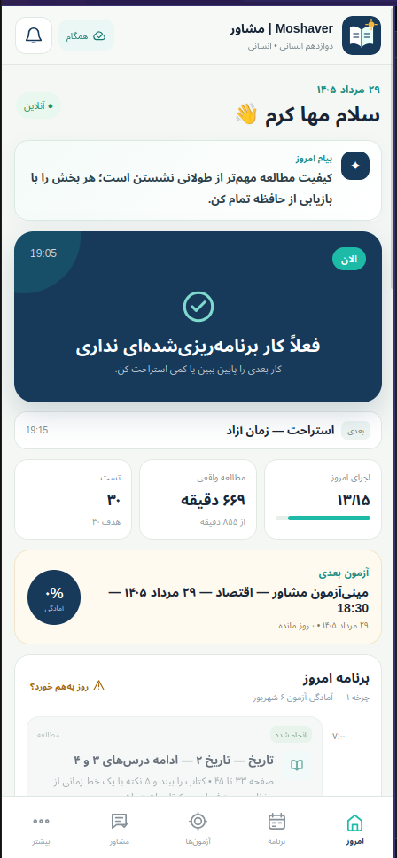
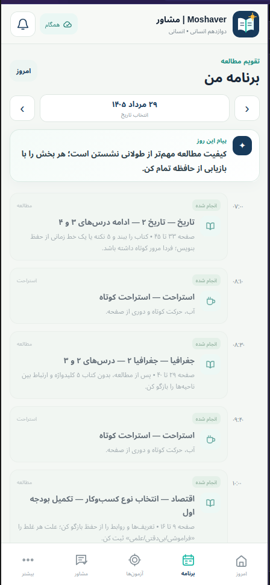
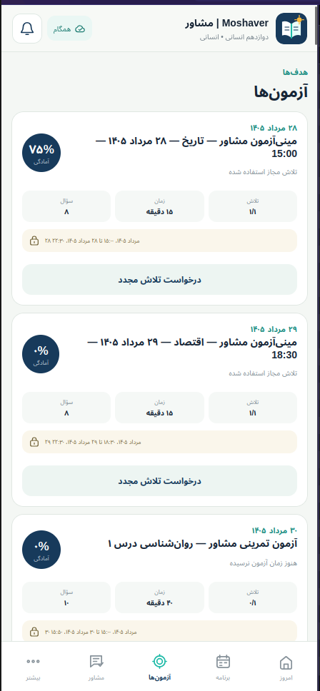
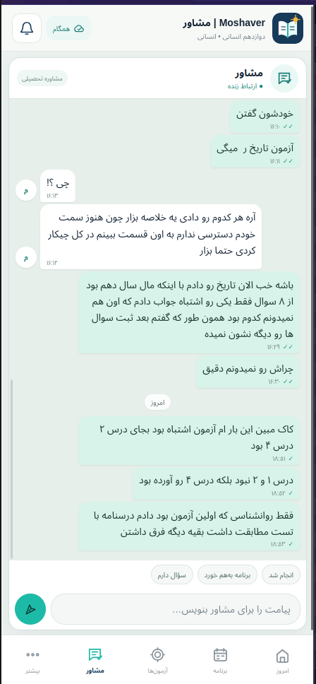
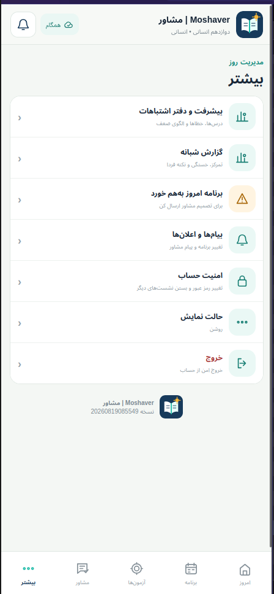

# 🎓 Moshaver | مشاور

> سیستم هوشمند همراهی و مشاوره تحصیلی برای مدیریت برنامه مطالعه، آزمون، ارتباط با مشاور و تحلیل پیشرفت دانش‌آموز

[]()
[]()
[]()
[]()
[]()
[]()
[]()

سیستم مدیریت و مشاوره تحصیلی برای همراهی روزانه دانش‌آموز.

Moshaver یک پلتفرم سبک و سریع است که شامل:

* 📱 اپلیکیشن دانش‌آموزی (PWA) مناسب برای موبایل و اندرویدهای ضعیف
* 💻 پنل مشاور/ادمین برای مدیریت برنامه، آزمون و ارتباط با دانش‌آموز
* ⚙️ بک‌اند جداگانه با Node.js و SQLite

هدف سیستم این است که مشاور بتواند:

* برنامه روزانه و هفتگی بسازد
* روند مطالعه دانش‌آموز را بررسی کند
* آزمون طراحی کند
* با دانش‌آموز ارتباط داشته باشد
* عملکرد دانش‌آموز را تحلیل کند

---

# 📱 پیش‌نمایش اپلیکیشن دانش‌آموزی

نسخه دانش‌آموزی Moshaver برای اجرا روی موبایل‌های ضعیف طراحی شده است.

ویژگی‌های اصلی:

* سرعت بالا
* مصرف کم منابع
* طراحی Mobile First
* آماده برای توسعه آینده با Tauri

## تصاویر محیط برنامه

<div align="center">

<table>
<tr>

<td align="center">

<br>
داشبورد دانش‌آموز
</td>

<td align="center">

<br>
برنامه روزانه
</td>

<td align="center">

<br>
سیستم آزمون
</td>

<td align="center">

<br>
چت با مشاور
</td>

<td align="center">

<br>
پروفایل دانش‌آموز
</td>

</tr>
</table>

</div>

---

# آدرس‌های Production

## اپلیکیشن دانش‌آموز

```
https://st.mahakaram.ir
```

دانش‌آموز از این آدرس وارد سیستم می‌شود.

---

## API Backend

```
https://api.mahakaram.ir/api/v1
```

تمام اطلاعات:

* برنامه‌ها
* آزمون‌ها
* پیام‌ها
* اعلان‌ها

از طریق این API مدیریت می‌شوند.

---

## پنل مشاور / Admin

در محیط Production:

```
https://admin.mahakaram.ir
```

در محیط توسعه محلی:

```
http://localhost:8081
```

---

# معماری سیستم

```
                 دانش‌آموز

        https://st.mahakaram.ir

                  │

                  │ API

                  ▼


          Backend API

 https://api.mahakaram.ir/api/v1


                  ▲


                  │


              Admin Panel

 https://admin.mahakaram.ir

```

---

# امکانات اصلی سیستم

## 👨‍🎓 امکانات دانش‌آموز

### داشبورد روزانه

دانش‌آموز می‌تواند:

* برنامه امروز را ببیند
* میزان پیشرفت خود را مشاهده کند
* وظایف انجام شده را ثبت کند
* انگیزه روزانه دریافت کند

---

### برنامه مطالعه

پشتیبانی از:

* برنامه روزانه
* برنامه هفتگی
* برنامه ماهانه

هر فعالیت شامل:

* ساعت شروع
* عنوان درس
* مدت مطالعه
* تعداد تست
* وضعیت انجام

---

### سیستم آزمون

امکانات:

* آزمون زمان‌دار
* سوالات چهارگزینه‌ای
* محدودیت تعداد تلاش
* ادامه آزمون نیمه‌تمام
* ارسال پاسخ
* درخواست آزمون مجدد

روند آزمون:

```
ساخت آزمون توسط مشاور

        ↓

انتشار

        ↓

فعال شدن در زمان مشخص

        ↓

شرکت دانش‌آموز

        ↓

ثبت نتیجه
```

---

### چت با مشاور

سیستم چت شامل:

* پیام متنی
* نمایش وضعیت خوانده شدن
* پاسخ سریع
* بروزرسانی لحظه‌ای با SSE

---

### اعلان‌ها

دانش‌آموز دریافت می‌کند:

* تغییر برنامه
* آزمون جدید
* پیام مشاور
* یادآوری‌ها

---

# 👨‍💻 امکانات پنل مشاور / Admin

## مدیریت برنامه

مشاور می‌تواند:

* برنامه روزانه بسازد
* برنامه هفتگی مدیریت کند
* وظایف را اضافه یا حذف کند
* برنامه را منتشر کند

---

## Import برنامه با JSON

مشاور می‌تواند برنامه را از فایل JSON وارد کند.

روند:

```
فایل JSON

      ↓

بررسی و اعتبارسنجی

      ↓

انتخاب دانش‌آموز

      ↓

Draft

      ↓

Publish

      ↓

نمایش برای دانش‌آموز
```

نکته:

دانش‌آموز انتخاب شده در پنل Admin مرجع اصلی ثبت اطلاعات است.

---

# مدیریت آزمون

مشاور می‌تواند:

* آزمون بسازد
* سوال اضافه کند
* زمان شروع تعیین کند
* زمان پایان تعیین کند
* تعداد دفعات شرکت را مشخص کند
* درخواست آزمون مجدد را بررسی کند

---

# ساختار Repository

```
moshaver-fullstack-v1.4.2/

├── backend/
│
├── student-app/
│
├── admin-app/
│
├── examples/
│   ├── week-plan-and-exam-v2.json
│   └── moshaver-summer-plan-1405-28mordad-to-10mehr.json
│
├── tests/
│
├── scripts/
│
└── docs/

```

---

# اجرای پروژه در محیط توسعه

نیازمندی:

```
Node.js 22.5+
```

اجرا:

```bash
cd moshaver-fullstack-v1.4.2

chmod +x start-dev.sh

./start-dev.sh
```

---

بعد از اجرا:

## Student

```
http://localhost:8080
```

## Admin

```
http://localhost:8081
```

## Backend API

```
http://localhost:4000/api/v1
```

## Health Check

```
http://localhost:4000/health
```

---

# اجرای Admin محلی با Backend Production

برای اتصال Admin محلی به API اصلی:

```bash
cd admin-app

chmod +x run-local-admin.sh

./run-local-admin.sh
```

سپس:

```
http://localhost:8081
```

باز کنید.

Admin درخواست‌ها را از:

```
http://localhost:8081/api/v1
```

به:

```
https://api.mahakaram.ir/api/v1
```

ارسال می‌کند.

---

# نمونه برنامه JSON

نمونه فایل‌ها:

```
examples/
```

شامل:

```
week-plan-and-exam-v2.json
```

و:

```
moshaver-summer-plan-1405-28mordad-to-10mehr.json
```

می‌باشد.

---

# امنیت سیستم

سیستم شامل:

* Session امن با Cookie HttpOnly
* CSRF Protection
* محدودسازی تلاش ورود
* مدیریت نقش‌ها
* CORS محدود شده
* SSE امن برای ارتباط لحظه‌ای

---

# Database

سیستم فعلی از SQLite استفاده می‌کند:

```
/data/konkur.sqlite
```

Migrationها به صورت افزایشی هستند.

یعنی:

* اطلاعات قبلی حذف نمی‌شوند
* برنامه‌ها
* گزارش‌ها
* پیام‌ها

حفظ می‌شوند.

---

# بررسی قبل از Deploy

قبل از انتشار نسخه جدید:

```bash
./scripts/validate-pack.sh
```

بررسی می‌کند:

* API
* Login
* Logout
* Session
* CSRF
* CORS
* آزمون‌ها
* JSON Import
* Chat
* Notification

---

# مسیر توسعه آینده

Moshaver آماده توسعه به نسخه‌های بعدی است:

## v1.5

* تحلیل بهتر آزمون
* بانک سوال
* گزارش عملکرد
* تجربه بهتر دانش‌آموز

## v2

معماری جدید:

* NestJS
* Fastify
* TypeORM
* PostgreSQL
* Tauri Mobile/Desktop App

---

# مستندات بیشتر

مستندات اصلی:

```
docs/README.md
```

راهنمای عملیات:

```
docs/REPO_AUDIT_AND_RUNBOOK.md
```

راهنمای Deploy:

```
docs/reference/RUNFLARE_DEPLOY.md
```

---

**Moshaver | مشاور**
یک همراه تحصیلی دیجیتال برای برنامه‌ریزی، آزمون، ارتباط با مشاور و پیشرفت روزانه دانش‌آموز.
