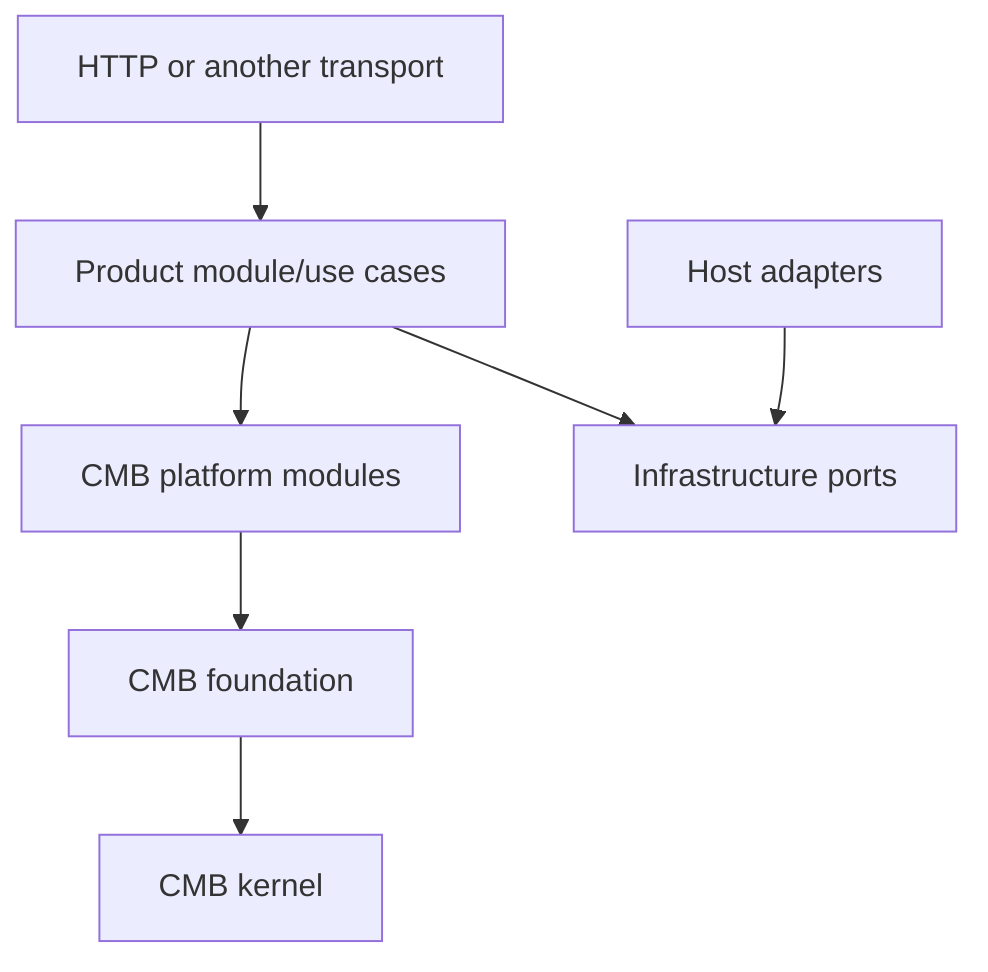
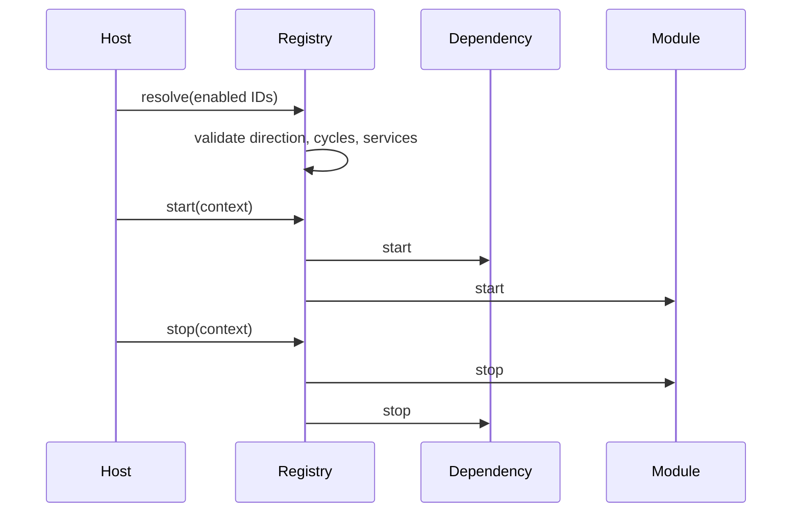
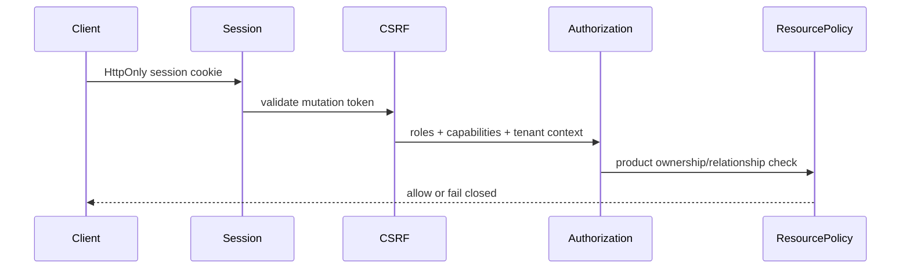
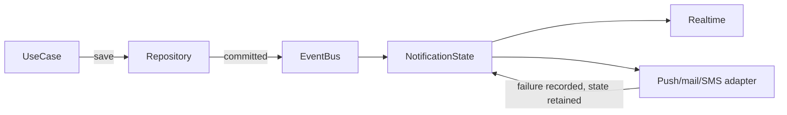
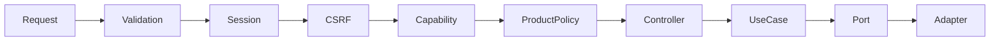

# CMB reference, compatibility, and release policy

## Purpose

CMB is the framework-neutral reusable backend layer below Moshaver product code.
The executable proof is `apps/cmb-reference`: a plain Node.js notes service with
generic `VIEWER` and `OPERATOR` roles/capabilities, cookie sessions, CSRF,
notifications/realtime, deterministic migrations, injected adapters,
health/readiness probes, and module metadata. It must never import an education
domain or NestJS adapter.



## Quick start

```bash
cd apps/cmb-reference
npm ci
npm test
PORT=3000 npm start
```

Create another service with the same safe baseline:

```bash
npm run generate:cmb-app -- --target=apps/example-service --name=example-service
cd apps/example-service
npm install
npm test
```

The generator only writes a new in-repository directory and refuses overwrite.
The generated service already contains a registered/tested notes module exposed
through HTTP, so the application and module path fits inside a ten-minute setup.

## Package map

| Layer | Packages | Ownership |
| --- | --- | --- |
| Kernel | `kernel` | descriptors, registry, lifecycle, dependency/service checks |
| Foundation | `health`, `persistence` | readiness, migration and unit-of-work contracts |
| Platform | `identity`, `tenancy`, `auth`, `authorization`, `system`, `realtime`, `notifications`, `activity`, `data-transfer` | reusable mechanisms without product roles or entities |
| Adapters | `infrastructure` | adapter inventory/readiness and dependency-free local defaults |
| Product | reference `notes`; Moshaver students/plans/exams/etc. | business policy and vocabulary |
| Applications | `apps/cmb-reference`, `apps/api` | composition, framework, transport, concrete vendors |

The machine-readable dependency graph is `tooling/workspace/projects.json`.
`npm run workspace:check`, `npm run architecture:check`, and
`npm run architecture:self-test` enforce direction and cycle rules.

## Module and public API contract

- `@moshaver/cmb-kernel` owns descriptors, stable tokens, dependency resolution,
  and ordered start/reverse-stop lifecycle hooks.
- Descriptors declare required/optional dependencies, provided/required services,
  routes, migrations, health contributions, permissions, configuration, and
  published/subscribed events. Empty declarations are explicit defaults.
- Foundation/platform packages expose only their package-root `exports` entry.
- Application adapters may depend on CMB; CMB cannot depend on application or
  product packages.
- A module can be disabled only when no enabled module requires it. Unknown,
  duplicate, missing, disabled, or circular dependencies fail before serving.
- Replaceability is demonstrated through constructor-injected ports; the
  reference service replaces its note store and delivery provider in tests.



If startup fails, already-started modules are stopped in reverse order. Optional
modules are enabled by the host list; disabling a required dependency fails before
the server listens. `GET /modules` in the reference app demonstrates tooling-safe
metadata and deterministic module-owned migration inventory.

## Configuration and adapters

Configuration belongs to the application composition root. Required values are
parsed and validated before listening; the reference app rejects invalid ports and
dependency flags. Never put provider secrets in module descriptors or domain code.

Stable adapter ports cover database persistence, cache, jobs, object storage,
delivery, event transport, clock, and ID generation. `CmbAdapterRegistry` reports
only port, adapter ID, and required status—never credentials. Required adapters
contribute readiness probes. The API registers `typeorm-sqlite`; a PostgreSQL
adapter may implement the same repository/unit-of-work ports without changing
product modules. Local development may use the in-memory/no-op implementations.

## Persistence and transactions

Every persistent module owns its entities/schema and migrations. Migration IDs use
`module:YYYYMMDDHHMMSS:name`; dependencies are explicit and the registry sorts
deterministically. A module must access another module through its public service,
not another module's private tables or repository.

For a new persistent module:

1. Define its repository port beside the use case.
2. Implement the port in the host adapter package/application.
3. Add `defineMigration` descriptors owned by the module.
4. Declare cross-module migration dependencies explicitly.
5. Use `UnitOfWork` for a workflow that must commit across module ports.
6. Test migration-from-zero and rollback on a disposable database.

SQLite production uses one API replica and a persistent `/data` disk. PostgreSQL
requires a separately tested TypeORM/data-source adapter and migrations; changing
only the connection string is not an approved database migration. Demo/test seeds
are explicit commands and are forbidden during production startup.

## Security model



Reusable security understands subjects, sessions, roles, capabilities, tenant IDs,
and policy extension points—not Moshaver roles. Threat assumptions:

- cookies may be sent automatically, therefore every authenticated mutation needs
  CSRF validation;
- client role/tenant headers are selection hints, never authority;
- missing work context, capability, membership, or resource policy fails closed;
- session revocation, expiry, and subject deactivation take effect immediately;
- DTO whitelisting prevents privilege/mass-assignment fields;
- login/signup throttling and audit events stay server-side;
- provider failure must not roll back durable notification state.

The generic app defines only `VIEWER` and `OPERATOR`. Package tests cover session
issuance, CSRF, expiry, revocation, and deactivation; the Moshaver security matrix
covers product roles, tenant isolation, resource policies, DTO protection, and SSE.

## Events, realtime, notifications, and jobs



Subscribe with the event port (`subscribe(type, listener)`) and publish a stable
event object after durable state succeeds. Add a delivery provider by implementing
`{ id, deliver(notification), ready? }` and registering it at the host. Provider
exceptions are returned as delivery outcomes and never delete the saved notification.
Jobs use the queue port and must be idempotent because adapters may retry them.
Realtime subscription and recipient selection remain authorized in the application
adapter; transport availability never determines durable state.

## Transport and API contracts

Domain/application use cases accept values, not HTTP requests. Controllers parse
transport input and delegate through public module entrypoints. Shared `/api/v2`
transport shapes belong to `packages/api-contract`; CMB service contracts belong
to their owning package. Errors use stable codes in the `ApiError` envelope.



## Testing and deployment profiles

- Package unit tests: public contract and failure behavior.
- Reference integration: HTTP, sessions, capabilities, CSRF, adapters, durable
  notifications, provider failure, readiness, module disabling.
- Backend composition: Nest adapters and `/api/v2` compatibility.
- Release: migration from zero, security matrix, contracts, architecture fixture,
  starter generation, package packing, Docker build and health checks.

Profiles are: local in-memory reference; local Moshaver SQLite; PaaS SQLite with one
replica/persistent disk; and a future PostgreSQL adapter only after compatibility
evidence. See `docs/operations/paas-deployment.md` for operator steps.

## Forbidden patterns

- CMB importing `apps/*`, product domains, NestJS, TypeORM, React, or vendor SDKs.
- Deep imports that bypass a package/module public entrypoint.
- Platform/foundation modules depending on product or adapter layers.
- Production startup running seeds or schema synchronization.
- Controllers containing business rules or domains consuming HTTP request objects.
- Durable state existing only in an SSE connection, job, or delivery provider.
- Logging secrets, session tokens, CSRF tokens, or provider credentials.

## Compatibility matrix

| Consumer | CMB line | Node line | Guarantee |
| --- | --- | --- | --- |
| Moshaver API v2 | `0.1.x` | Node 22 | Source and behavior compatibility verified by repository CI |
| CMB reference service | `0.1.x` | Node 22 | Framework/domain independence and starter smoke tests |

All CMB packages currently remain private and versioned `0.1.0`. Until a first
public `1.0.0`, a minor release may change APIs; every such change must update all
consumers atomically in this repository. Patch releases must remain compatible.
The current decision is lockstep-minor compatibility with independently versioned
patches. `tooling/cmb/compatibility.json` and `npm run cmb:compatibility` enforce the
supported line, private/public state, root-only exports, and current consumers.

## Release procedure

1. Update the changed package version and public type declarations together.
2. Add behavior tests at the public entrypoint; never test private deep imports.
3. Run `npm run workspace:check`, `npm run architecture:check`,
   `npm run contracts:check`, `npm run test:generators`, and `npm run verify`.
4. Confirm the fresh-database migration and authorization-matrix CI jobs pass.
5. Record intentional breaking changes and the consumer migration in release notes.
6. Publish packages only after removing `private: true` through a separately
   reviewed release change. The current repository does not publish CMB packages.

Every reusable release note must identify security impact, deprecated surfaces,
migration steps, and affected consumers. Breaking APIs need at least one supported
migration release before removal after `1.0.0`; pre-1.0 breaks require an atomic
repository migration. The legacy `0.1.0` descriptor fixture proves additive metadata
defaults remain upgrade-compatible.

## API evolution and errors

Moshaver HTTP compatibility remains `/api/v2`; reusable packages do not own that
route version. Breaking transport changes require a new API version or a documented
deprecation window. Deprecations must identify the replacement and removal release.
Errors use the documented `ApiError` envelope and stable machine-readable `code`;
clients must not branch on human-readable messages.

## CI evidence

`cmb-packages-quality.yml` tests every package, the non-education service, generator,
architecture boundaries, and contracts. `backend-v2-quality.yml` additionally runs
all migrations against an empty SQLite database and exercises the complete security
role matrix against a disposable database. `deployment-readiness.yml` validates and
builds production container definitions.

All three workflows are release-blocking for changes in their path scope. A release
must also have green Admin and Student quality workflows, workspace/Graphify gates,
and the repository safety workflow. An external registry outage is recorded as an
evidence gap; it is never silently treated as a successful audit or image build.
