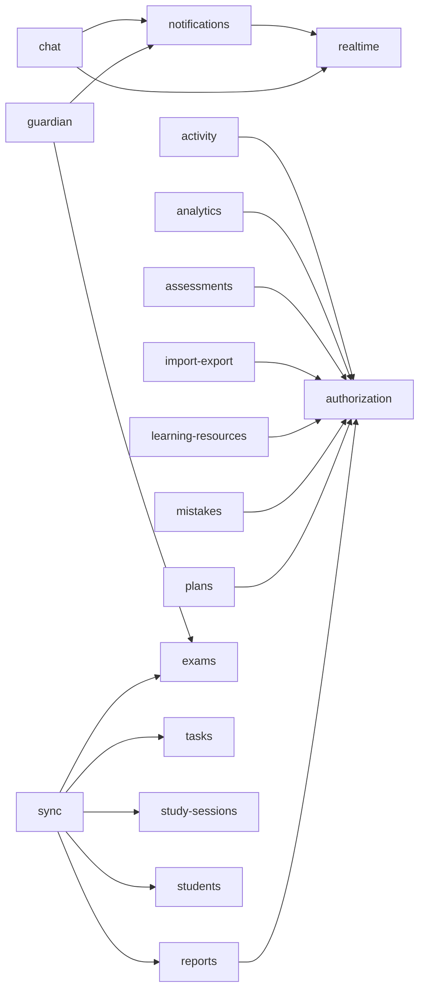

# Backend v2 dependency map

**Evidence:** current source on `develop` at `e6185d391030bb012aad8404bd61b5b91ab964ab`.

This map records explicit Nest module imports observed during Phase 1. It does not claim to be the complete file/entity/data dependency graph. A fresh Graphify graph should later validate and extend it.

## Direct registered-module edges



## High-coupling nodes

### Authorization — highest explicit fan-in

Observed direct consumers:

- activity
- analytics
- assessments
- import-export
- learning-resources
- mistakes
- plans
- reports

This makes authorization a high-impact extraction boundary. It should not move to CMB until its `Student`/relationship persistence dependencies are replaced by generic resource/policy contracts.

### Realtime — clean platform dependency

Observed consumers:

- notifications
- chat

Realtime has no TypeORM feature registration in its module and exports a service. It is a good W1 proof for reusable platform packaging.

### Notifications — platform mechanism with product recipient coupling

Observed consumers:

- chat
- guardian

Notifications itself depends on realtime, but currently stores/loads `Student` and `User` directly. Extract the delivery/state mechanism only after a generic recipient/identity contract exists.

### Sync — highest explicit product fan-out

Sync imports:

- tasks
- study-sessions
- reports
- students
- exams

It also registers many product entities itself. Treat sync as Moshaver product orchestration, not generic CMB infrastructure, until a generic synchronization engine can be separated from education-specific handlers.

## Hidden coupling not visible in Nest module metadata

The Nest graph is necessary but insufficient.

### Dashboard

`DashboardModule` declares no module imports, but `DashboardService` uses `DataSource` and raw SQL across conversations/messages, plans/tasks, task issues, recovery requests, exam retry requests, subjects, exams, mistakes, quizzes, organizations, memberships, users, audit logs, and login throttles.

Result: classify dashboard as product read-model/orchestration even though its Nest module appears isolated.

### Onboarding

`OnboardingModule` only registers signup-throttle persistence, while `OnboardingService` directly coordinates users, students, organizations, memberships, role assignments, advisor relationships, and conversations inside transactions.

Result: keep onboarding product-owned and later replace private persistence access with public application services/contracts.

### Import/export

`ImportExportModule` only imports authorization, but its service directly imports plan, task, student, exam, question, organization, user, and import-history entities and owns an education-specific schema.

Result: split generic import/export mechanics from Moshaver codecs/handlers; do not extract the current service wholesale.

### Shared database entity catalog

Most modules import entities directly from `apps/api/src/database/entities` or individual files below it. This shared catalog is the largest architectural coupling hotspot because table/entity ownership is not yet aligned to module ownership.

## Desired dependency evolution

```text
current product orchestrator
        ↓
module public application API / port
        ↓
module-owned domain + persistence boundary
        ↓
CMB platform contracts where needed
```

Avoid future code where an orchestrator reaches directly into another module's private TypeORM entities or tables.

## Graphify validation checklist

When a fresh `graphify-out/graph.json` is available, query/verify at least:

- all callers/consumers of `AuthorizationService`;
- paths from `SyncService` to student/exam/task/report persistence;
- paths from `DashboardService` to database entities/raw tables;
- paths from `OnboardingService` to chat/organization/student persistence;
- inbound consumers of `RealtimeService` and `NotificationsService`;
- cycles between module service files;
- deep imports from one module into another module's implementation;
- imports from any future `packages/cmb/*` path back into product code.

Any discrepancy between generated graph evidence and this document should be resolved by checking current source before changing the classification.
