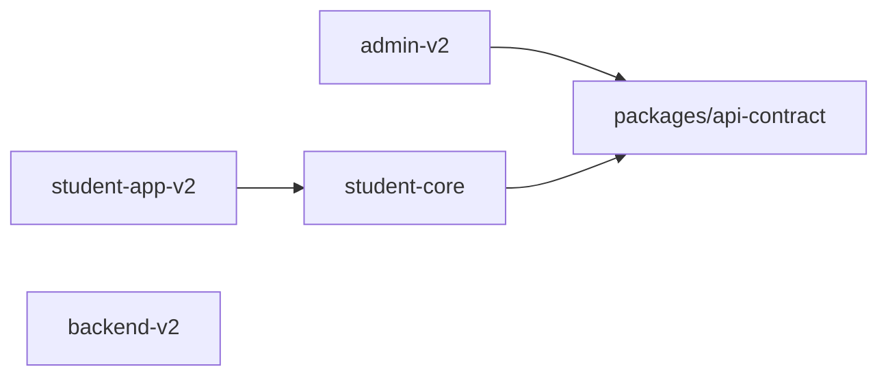

# Current project/package consumers

**Source:** package manifests on `develop` at `e6185d391030bb012aad8404bd61b5b91ab964ab`.

## Workspace-level dependency graph



## Verified package dependencies

| Consumer | Dependency | Current form |
| --- | --- | --- |
| `apps/admin` | `@moshaver/api-contract` | `file:../packages/api-contract` |
| `student-core` | `@moshaver/api-contract` | `file:../packages/api-contract` |
| `apps/student` | `@moshaver/student-core` | `file:../student-core` |
| `apps/api` | none of the current workspace packages | standalone package manifest |

## Consequence: API contract ownership gap

`@moshaver/api-contract` is currently shared by Admin and student-core, but backend-v2 does not consume it at package level. Backend HTTP DTOs/contracts therefore remain independently implemented.

This does **not** prove a runtime incompatibility, but it is an architecture drift risk. CMB issue #27 should decide whether:

1. backend becomes an authoritative producer/consumer of shared transport contracts;
2. OpenAPI/code generation becomes the authoritative source;
3. `api-contract` is explicitly client-only and validated against backend through contract tests.

Do not simply import frontend-oriented contracts into backend implementation without resolving ownership and versioning first.

## Student boundary

The current student dependency direction is healthy at package level:

```text
student-app-v2
     ↓
student-core
     ↓
api-contract
```

`student-core` should remain runtime-neutral. Tauri, browser storage, React, notifications, and concrete transport/storage adapters remain in the student app/runtime layer.

## Phase-2 implication

When a root workspace/task graph is introduced, preserve these logical edges and make build order explicit. Do not use workspace conversion as a reason to create additional cross-application imports.
